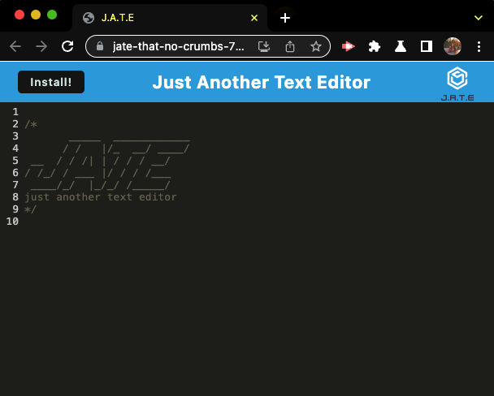
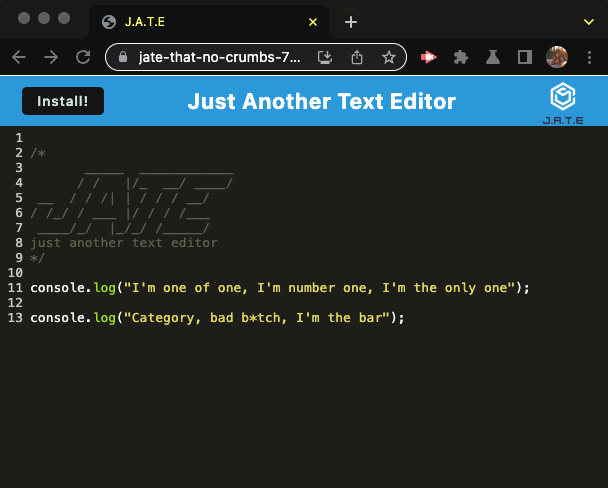
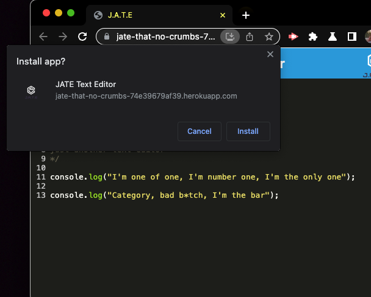
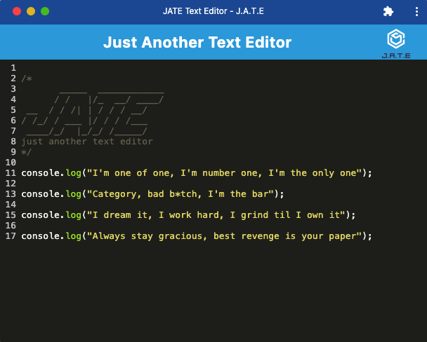
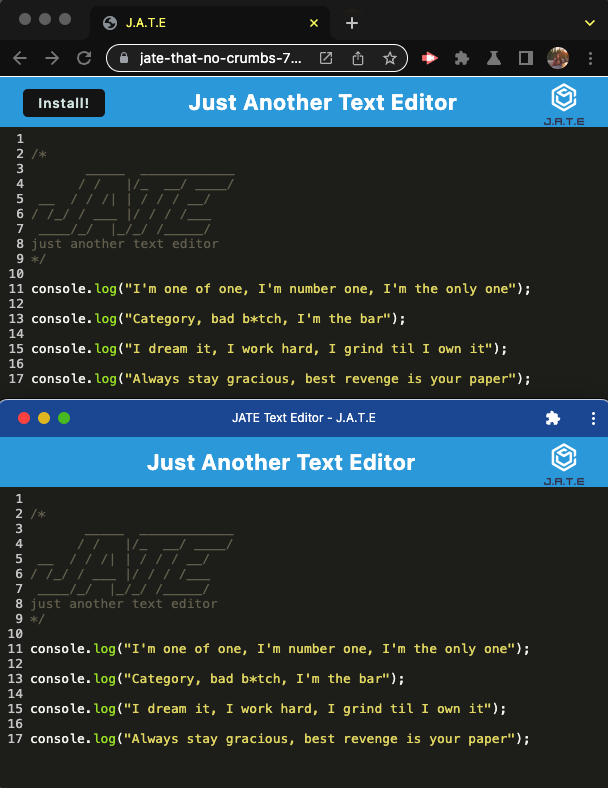

# Text Editor

> ## DESCRIPTION
  An installable text editor that will allow you write notes or code snippets with or without internet.

## TABLE OF CONTENTS
  1. [Description](#description)
  2. [Usage](#usage)
  3. [References](#references)
  4. [License](#license)
  5. [Contributing](#contributing)
  6. [Questions](#questions)

> ## USAGE

#### Click the link to the site [Jate That No Crumbs](https://jate-that-no-crumbs-74e39679af39.herokuapp.com/)   

#### You Can enter text or code snippets directly on the site   
#### To install click the `Install!` button, open the downloaded app to be able to use offline. Your notes entered on the site will be accessible on your app  
  
 
#### Notes written on your app or on your browser window will be accessible on both  

> ## REFERENCES
- UConn Coding Bootcamp - Module 19 PWA Lessons

> ## LICENSE
 
Please see the LICENSE file for details

> ## CONTRIBUTING
#### If you are interested in contributing to this project, please follow these steps:
- Fork the repo on GitHub
- Clone the project to your own machine
- Commit changes to your own branch
- Push your work back up to your fork
- Submit a pull request for review

> ## QUESTIONS
For any questions, please reach out to me via GitHub (https://github.com/SLAYsian).
